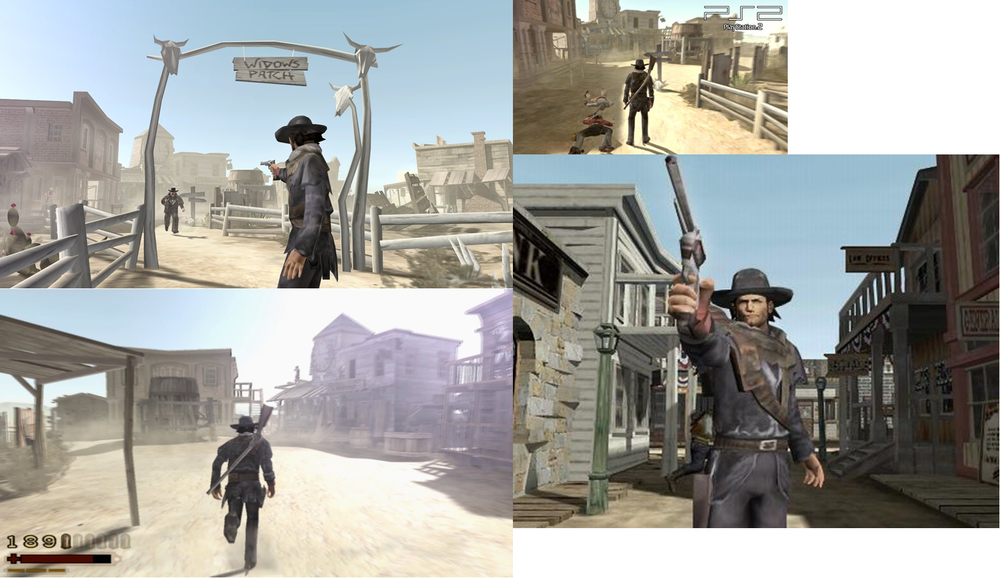
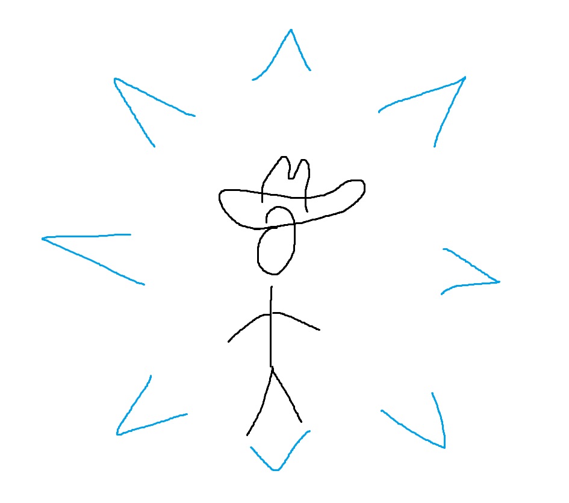
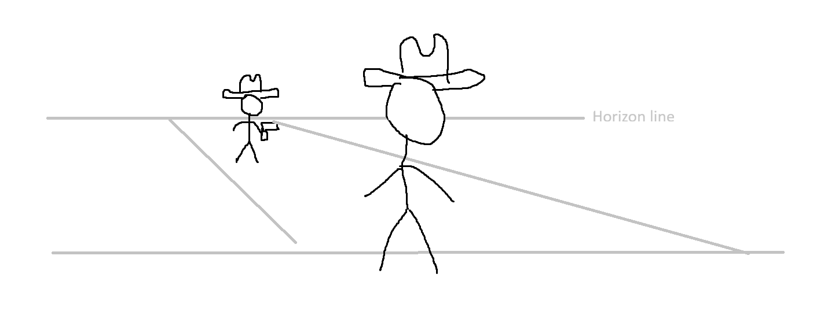
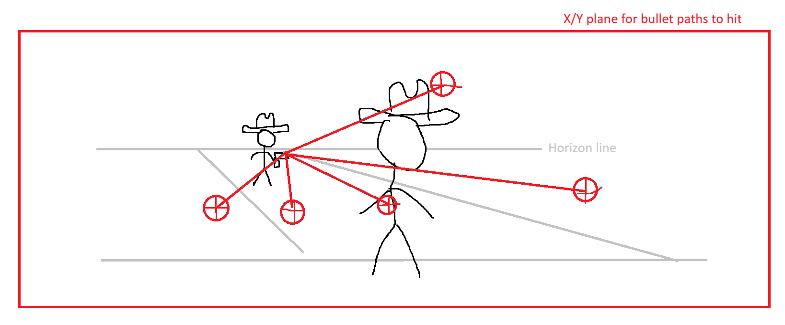
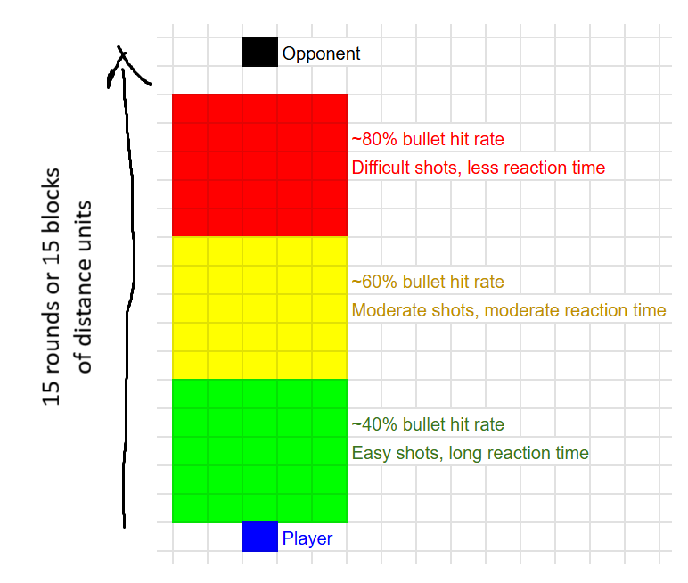

# untouchables

## High Level Vision

- Game is inspired by [Sword Art Online II - Kirito Playing Untouchable](https://youtu.be/iVkQbrJD8vk?si=3J471VwZ-iic_NKD)
- Similar to Red Dead Revolver in aspects of third person camera and visual style, but gameplay mechanics will differ in a way that makes the game a puzzle turn-based 3rd person action game built with Unity game engine
- PC/Steam will be the main platform that the game will run on. Using Unity, I will also try to build the game for mobile devices
- Target audience is Teens+ because of guns and blood
- Business model for this game will be a one time purchase to play forever

## Art Style / Theme

Screenshots from Red Dead Revolver

- User interface - minimalistic
- Environments - wild west arid desert climate, tumbleweeds, cactus, dry and sometimes sand blows in the air
- Characters - low poly but somewhat realistic style
- Rendering style - 3D 3rd person view

## Story

No real story. You are a cowboy without your revolver and you are met with an opponent that is a long distance away but you stand within his shooting distance. Your opponent reloads fast and shoots fast. Dodge his bullets and run towards him and knock him out.

## Core Loop

## Screens, UI, UX

- Initial hint for directional dodging but will be invisible afterwards

- Perspective

- Bullet Paths

## Game Economy

There is no game economy.

## Asset List

The game will be created using free assets.
|Category|Environment Assets|Description|
|:---:|:---:|:---:|
|Full screen|Sky Background|2D image of sky|
|3D|Taverns/saloons/parlors|Wild West Buildings etc|
|3D|Opponent character model|Opposing cowboy|
|3D|Main actor model|Playable cowboy|
|3D|Revolver|Gun|
|3D|Arid Desert assets|Cactus, Tumbleweed, etc|
|3D|Misc. wooden fences and poles|Complement wild west environment

## Level Schema and Sample Level Design

As you approach the opponent, his accuracy is higher and reload speed faster. The player will have less time to make a directional dodge decision.

## Team, Schedule, and Budget

Jeremy Ng will do everything. There are no plans to work in a group. The game will be designed using free assets.
